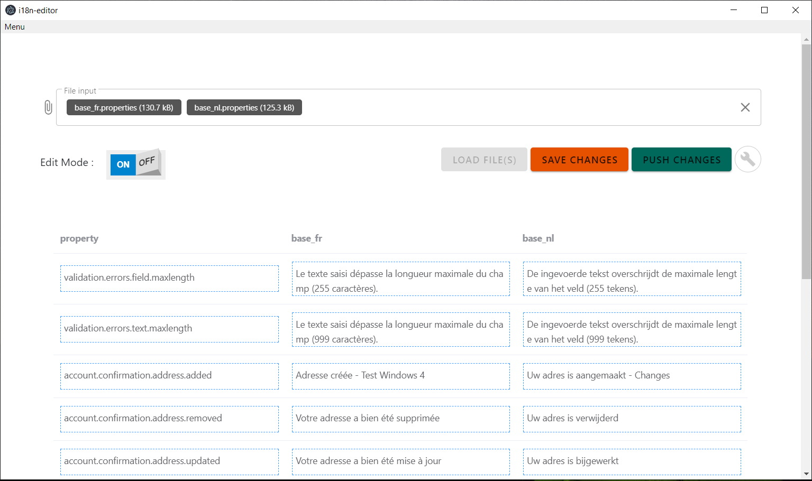

# i18n-editor

> A Simple localization properties Editor

###### A simple yet easy to use desktop application to manage your localization properties ( a.k.a Resources bundle ). 

### Release 

You can download a working binary  for Windows ( .exe )   & Linux ( .AppImage ) from the tags. 

> Built with Vue.js & Electron.js 